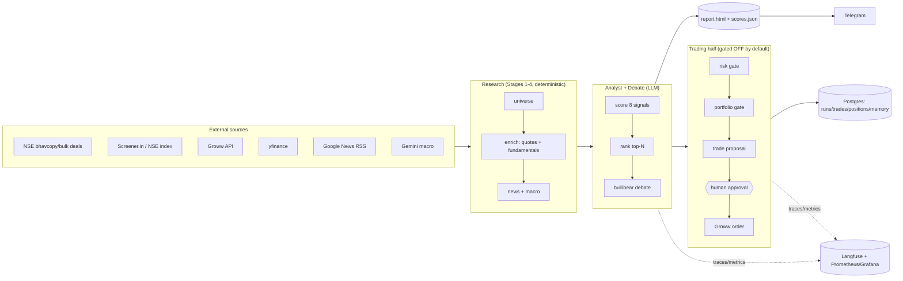
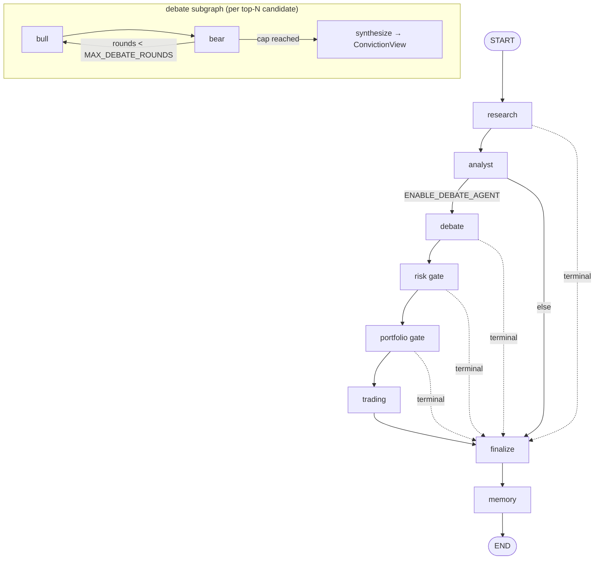
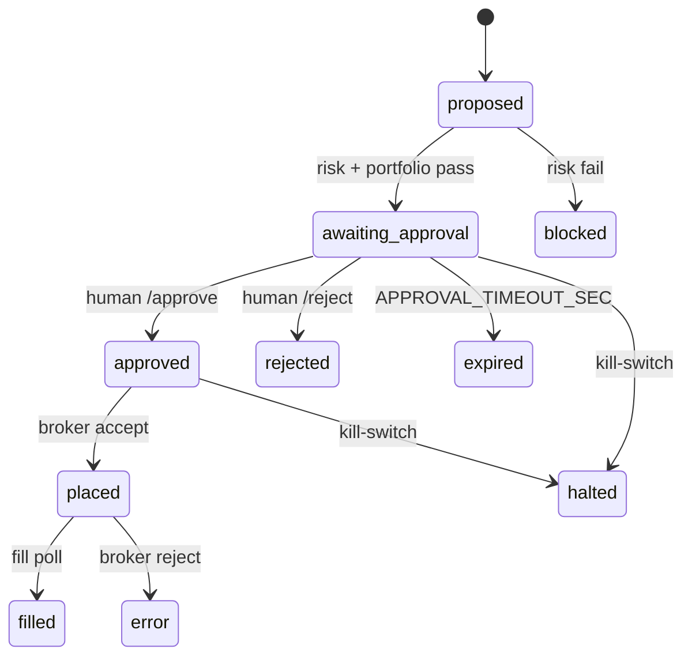

# Stock Intelligence

A daily stock-scoring system for Indian markets (NSE/BSE) that pulls fundamentals, enriches with live price data + news, scores each stock with an LLM, and delivers a ranked HTML report + Telegram notification. It runs in two forms:

- **`main.py`** — the original 7-stage sequential pipeline (still fully runnable).
- **`run_agents.py`** — the same work re-platformed onto a **LangGraph multi-agent system** that adds a bull/bear debate, risk/portfolio gates, and a human-approved live-trading path. Trading is hard-gated **OFF** by default; in research mode the agent run reproduces the pipeline's report.

---

## Contents

- [Architecture](#architecture)
- [The agent graph](#the-agent-graph)
- [Agents](#agents)
- [State & contracts](#state--contracts)
- [Human-in-the-loop trading gate](#human-in-the-loop-trading-gate)
- [LLM provider switch (Anthropic / OpenRouter)](#llm-provider-switch)
- [Persistence (Postgres)](#persistence-postgres)
- [Observability](#observability)
- [Setup & configuration](#setup--configuration)
- [Running](#running)
- [Tests](#tests)
- [Deployment](#deployment)
- [Cost](#cost)
- [Project layout](#project-layout)
- [Roadmap](#roadmap)

---

## Architecture

High-level data flow. The deterministic data stages (1–4) are shared by both entrypoints; the agent system wraps them as graph nodes and adds the reasoning/trading half.



**Stack:** Python 3.12 · LangChain + LangGraph (orchestration) · Anthropic / OpenRouter (LLMs) · Postgres (durable agent + trading state) · Langfuse + Prometheus/Grafana (observability) · Groww + yfinance + Screener.in + Gemini (data).

---

## The agent graph

`run_agents.py` compiles a LangGraph `StateGraph` (`agents/graph.py`). Each node returns a partial state update; conditional edges route the run. **Any terminal status short-circuits straight to `finalize`**, and the trading chain only executes when its feature flags are on.



Default-on path is `research → analyst → finalize → memory` (research mode). `debate`, `risk`, `portfolio`, `trading`, and `memory` are each gated by their `ENABLE_*` flag. The risk/portfolio gates mark individual proposals BLOCKED/REJECTED but the run still advances; only a **terminal run status** (HALTED / FAILED / BUDGET_EXCEEDED) short-circuits straight to `finalize`.

### The `agent_node` supervisor contract

Every node is wrapped by `agent_node` (`agents/nodes/base.py`), which enforces:

- **kill-switch** → `HALTED` (flag file `output/kill_switch.flag` or `KILL_SWITCH=true`),
- **per-run budget** → `BUDGET_EXCEEDED` (`MAX_RUN_COST_USD` / `MAX_RUN_TOKENS`),
- **feature-flag skip** → clean audit-only pass-through when the node's `ENABLE_*` flag is off,
- **timing + audit trail** (and Prometheus latency),
- **exception isolation** → unexpected errors become a terminal `FAILED` (the run never crashes).

The graph is invoked with `recursion_limit = MAX_GRAPH_STEPS`; the debate loop is independently bounded by `MAX_DEBATE_ROUNDS`. These are the runaway-loop guardrails.

---

## Agents

| Agent / node | Responsibility | Kind | Status |
|---|---|---|---|
| **Supervisor** (`graph.py` + `supervisor.py`) | run lifecycle, conditional-edge routing, terminal-state + kill-switch escalation | control | done |
| **Research** (`nodes/research.py`) | Stages 1–4: universe + bhavcopy/bulk deals + Groww/fundamentals + news/macro; skip-list | deterministic | done |
| **Analyst** (`nodes/analyst.py`) | Stage 5 scoring + Stage 6 ranking; emits `Scorecard`/`RankingResult` | LLM | done |
| **Debate** (`nodes/debate.py`) | bounded bull↔bear→synthesize subgraph per top-`DEBATE_TOP_N` → `ConvictionView` | LLM | **done** |
| **Risk Manager** (`nodes/risk.py`) | long-only, min-conviction, earnings block, no-duplicate → `RiskCheck` gate | deterministic | done |
| **Portfolio Manager** (`nodes/portfolio.py`) | sizes by capital×pct×conviction; `MAX_OPEN_POSITIONS` + `MAX_SECTOR_PCT` caps → APPROVED/REJECTED | deterministic | done |
| **Trading** (`nodes/trading.py`) | paper: simulate fills + persist book; live: `interrupt()` human approval → gated broker | gated | done |
| **Broker** (`broker/groww_trader.py`) | the only order-placement seam; default-deny gate, idempotent | gated | done* |
| **Monitoring** (`nodes/monitoring.py`) | scheduled (market-hours) stop-loss watch → alerts; paper auto-exit, live alert-only | deterministic | done |
| **Memory + Backtest** (`nodes/memory.py`) | records calls/regime to long-term store + per-signal accuracy self-eval from the backtest log | deterministic | done |

---

## State & contracts

**State** (`agents/state.py`): `AgentState` is the LangGraph run state, checkpointed per run (`thread_id = run_id`). List fields (`scorecards`, `convictions`, `proposals`, `alerts`, `audit`) use an **additive reducer** so worker nodes append compact results instead of overwriting each other.

`RunStatus` is the explicit terminal-state enum: `RUNNING | COMPLETED | AWAITING_APPROVAL | HALTED | FAILED | MAX_ROUNDS | BUDGET_EXCEEDED`.

**Contracts** (`agents/contracts.py`): typed Pydantic models are the **seam** between the agent layer and the existing dict-based modules. Key models expose `from_legacy(d)` / `to_legacy_dict()`:

- `EnrichedStock` — typed mirror of the accumulated stock dict (`52w_high` ↔ `week52_high`; unknown keys preserved in `extra`).
- `Scorecard` — round-trips the exact `signals[k]["score"]` shape the ranker + Telegram expect.
- `ConvictionView` — debate output: `{ticker, direction, conviction, bull_case, bear_case, transcript, composite_score}`.
- `TradeProposal` / `RiskCheck` / `Position` / `PortfolioState` / `Alert` — the trading half.

Nodes never reach into each other's internals — they pass these contracts via the blackboard.

---

## Human-in-the-loop trading gate

Live orders are **default-deny**. An order is placed only if **all** hold: `ENABLE_LIVE_TRADING` **and** `AGENT_MODE == "live"` **and** no kill-switch **and** explicit human approval. `paper` mode writes a simulated fill instead of calling the broker.



Mechanism (`agents/nodes/trading.py` + `agents/approval.py` + `agents/broker/groww_trader.py`): in live mode the Trading node marks each approved proposal `AWAITING_APPROVAL`, persists it, and calls LangGraph **`interrupt()`** — the run suspends with full state checkpointed (`AWAITING_APPROVAL`) and the orchestrator sends the Telegram `/approve <id>` / `/reject <id>` message. A human reply resumes the *exact* run via `Command(resume=decisions)` (`run_agents.py --resume <run_id> --approve/--reject <id>`). Only then does the broker run — and `place_order` is **default-deny**, re-checking `mode=="live"` + `ENABLE_LIVE_TRADING` + `GROWW_TRADING_ENABLED` + no kill-switch, and refusing to resubmit a proposal that already has a `broker_order_id`.

> **\*Broker note:** live order placement is gated OFF by default and the exact `growwapi` `place_order` params should be verified against your installed SDK before enabling. **Cross-process resume requires `DATABASE_URL`** so the suspended run lives in the Postgres checkpointer; with the in-memory fallback, resume only works within the same process.

---

## LLM provider switch

All LLM calls route through `llm_router.py`, so you can swap Claude for cheaper OpenAI-compatible models on OpenRouter (DeepSeek/Qwen/Kimi, ~10–50× cheaper) **without code changes**:

```bash
LLM_PROVIDER=anthropic          # default — keeps the Anthropic Batch API (50% off)
# or
LLM_PROVIDER=openrouter
OPENROUTER_API_KEY=sk-or-...
OPENROUTER_SCORING_MODEL=deepseek/deepseek-chat
OPENROUTER_REPORT_MODEL=deepseek/deepseek-chat
```

It is wired into scoring (`scoring/claude_scorer.py`), the narrative (`reports/daily_report.py`), and the agent LLM factory (`agents/llm.py`, used by the debate). **Caveat:** the Anthropic Batch API discount is provider-specific — OpenRouter uses one sync call per stock. Validate cheaper models against the **backtest** before trusting them for trading decisions.

---

## Persistence (Postgres)

Postgres owns agent + trading state; research output stays as files. When `DATABASE_URL` is unset it falls back to an in-memory checkpointer, so research mode and tests run without a DB.

- **LangGraph-managed:** checkpoints (resumable runs / the approval interrupt) + long-term memory store.
- **App tables** (`persistence/models.py`): `runs`, `trade_proposals`, `positions`, `orders`, `agent_audit`, `memory`.

Recommended managed Postgres: **Neon** (free tier, autosuspend/autoresume — ideal for a once-daily job).

---

## Observability

Both layers no-op when their deps/keys are absent.

- **Langfuse** (`observability/langfuse_cb.py`) — LLM/agent traces + token/cost, one trace per run.
- **Prometheus/Grafana** (`observability/metrics.py`) — run/node latency, scores, proposal counts, errors.
- **Local stack:** `deploy/docker-compose.obs.yml` brings up postgres + langfuse + prometheus + grafana.
- **Prod:** use **Langfuse Cloud** (free tier) — set `LANGFUSE_*` and per-run LLM cost/latency/trace history is viewable anytime, no 24/7 node. This covers the high-value observability for a daily job.
- **Custom metrics (optional):** a Cloud Run Job scales to zero, so the pull-based `/metrics` endpoint is never scraped. Set `PROMETHEUS_PUSHGATEWAY_URL` to **push** at end of run (`metrics.push_metrics`, no-op when unset). That targets a Prometheus **Pushgateway** — **Grafana Cloud** ingests via remote_write/OTLP (run **Grafana Alloy**), not a raw gateway. For most setups Langfuse alone suffices.

---

## Setup & configuration

```bash
python -m venv venv && source venv/bin/activate
pip install -r requirements.txt
cp .env.example .env   # fill in your keys
```

Only `ANTHROPIC_API_KEY` is required; everything else is optional with graceful fallback.

| Variable | Description |
|---|---|
| `ANTHROPIC_API_KEY` | **Required.** console.anthropic.com |
| `LLM_PROVIDER` | `anthropic` (default) or `openrouter` |
| `OPENROUTER_API_KEY` / `OPENROUTER_*_MODEL` | Only when `LLM_PROVIDER=openrouter` |
| `GEMINI_API_KEY` | Macro context (1500 req/day free) |
| `TELEGRAM_BOT_TOKEN` / `TELEGRAM_CHAT_ID` | Notifications / approvals |
| `GROWW_TOTP_TOKEN` / `GROWW_TOTP_SECRET` | Groww auth (quotes; later, orders) |
| `STOCK_UNIVERSE` | `nifty50/100/200/500` or `screener` (default `nifty200`) |
| `SCREENER_*` | Only when `STOCK_UNIVERSE=screener` |
| `MAX_STOCKS_TO_SCORE` | Cap before LLM (default 100, by market cap) |
| `AGENT_MODE` | `research` (default) / `paper` / `live` |
| `ENABLE_*_AGENT` | Per-node flags (research + analyst on; rest off) |
| `MAX_DEBATE_ROUNDS` / `DEBATE_TOP_N` | Debate turn cap (3) / candidates debated (5) |
| `ENABLE_LIVE_TRADING` / `KILL_SWITCH` | Live-trading hard gate (off) / emergency stop |
| `MAX_RUN_COST_USD` / `MAX_RUN_TOKENS` | Per-run budget guardrails |
| `MAX_OPEN_POSITIONS` / `MAX_POSITION_PCT` / `MAX_SECTOR_PCT` / `STOP_LOSS_PCT` | Risk limits |
| `DATABASE_URL` | Postgres (empty → in-memory fallback) |
| `LANGFUSE_PUBLIC_KEY` / `LANGFUSE_SECRET_KEY` / `LANGFUSE_HOST` | Observability |

---

## Running

```bash
# Legacy pipeline
bash run_local.sh                 # full run
bash run_local.sh --dry-run       # 5 stocks, fast
python main.py --date 2026-05-14

# Multi-agent system
python run_agents.py --mode research [--dry-run] [--date YYYY-MM-DD]
python run_agents.py --kill        # engage kill-switch (creates output/kill_switch.flag)
python run_agents.py --unkill      # clear it

# Live mode suspends for approval; resume the exact run (needs DATABASE_URL):
python run_agents.py --resume <run_id> --approve <proposal_id> [--reject <id>]

# Monitoring — short, scheduled market-hours run (stop-loss watch on open positions):
python run_agents.py --mode monitor
```

Each run writes `output/YYYY-MM-DD/{scores.json, report.html}` and appends `output/backtest_log.json`.

---

## Tests

```bash
python -m pytest tests/ -v
```

No `.env` needed — tests mock `config` entirely and use `MemorySaver` for the graph. **68 tests** cover prompts, ranker, backtest engine, Screener filters, fundamentals + news, the LLM provider switch, agent contracts + graph routing/guards, the bounded debate subgraph, the risk/portfolio gates + paper fills, the live broker gates + `interrupt()` approve/reject, the monitoring stop-loss watch, and the memory store + node.

---

## Deployment

Everything runs on a single **GCP `e2-small` VM**. Two systemd services: `stock-scheduler` (Python cron) and `stock-chat` (Telegram webhook via uvicorn + nginx).

### First-time setup

```bash
cp deploy/terraform/terraform.tfvars.example deploy/terraform/terraform.tfvars  # fill in secrets
bash deploy/deploy.sh
```

### Every deploy (code changes or infra changes)

```bash
git push origin main
bash deploy/deploy.sh
```

That's it. The script auto-detects whether terraform needs to run (any `.tf` / `.tfvars` changed) and always SSHes into the VM to `git pull` + restart services.

### Testing outside market hours (VM is stopped)

```bash
bash deploy/deploy.sh --no-schedule   # VM stays up, no auto-stop

gcloud compute ssh stock@stock-intelligence-vm --zone asia-south1-a #SSH into the VM
```

Re-enable the schedule when done:
```bash
bash deploy/deploy.sh                 # re-attaches market-hours schedule
```

### VM schedule (market hours only, to save cost)

| Day | Start (IST) | Stop (IST) |
|-----|-------------|------------|
| Monday | 05:00 (early — post-weekend) | 16:00 |
| Tue–Fri | 08:30 | 16:00 |
| Sat–Sun | off | — |

### Scheduler

`scheduler/runner.py` polls Postgres every 30 s. Default schedules:

| Name | Cron (UTC) | IST |
|------|-----------|-----|
| research | `30 6 * * 1-5` | 12:00 noon |
| intraday | `30 18 * * 1-5` | midnight |
| watch | `*/3 * * * 1-5` | every 3 min |

---

## Cost

VM: ~$5–7/month (`e2-small`, ~55 hours/week runtime — off nights and weekends). LLM tokens:

- **Research (OpenRouter/DeepSeek):** ~$1–3/month
- **Research (Claude Haiku/Sonnet):** ~$6–12/month
- **+ Debate (Claude Sonnet):** ~$35–45/month (tune `DEBATE_TOP_N` / `MAX_DEBATE_ROUNDS`)

`MAX_RUN_COST_USD` hard-stops a runaway run.

---

## Project layout

```
.
  main.py               # legacy 7-stage pipeline (runnable)
  run_agents.py         # multi-agent (LangGraph) entrypoint
  llm_router.py         # provider switch (anthropic | openrouter) + model resolution
  config.py             # all settings from .env
  scrapers/             # Stages 1-2: universe + NSE bhavcopy/bulk deals
  enrichment/           # Stages 3-4: Groww + yfinance + news + Gemini macro
  scoring/              # Stages 5-6: LLM scoring + weighted ranker
  backtest/             # Stage 7: T+1/T+3/T+5 backtest vs Nifty 50
  reports/              # HTML report (Jinja2) + LLM narrative
  notifications/        # Telegram delivery
  agents/               # LangGraph multi-agent layer (wraps the modules above)
    graph.py state.py contracts.py supervisor.py llm.py approval.py
    nodes/              # research, analyst, debate, risk, portfolio, trading, monitoring, memory
    broker/groww_trader.py  # the only live order-placement seam (default-deny)
  persistence/          # Postgres ORM (runs, proposals, positions, ...) + store.py (paper book)
  observability/        # Langfuse callback + Prometheus metrics
  deploy/               # deploy.sh + terraform/ + docker-compose.obs.yml + setup_gcp.sh
  tests/                # pytest (no API keys needed)
  output/               # YYYY-MM-DD/{scores.json, report.html}, backtest_log.json
```

---

## Roadmap

1. ✅ LangGraph scaffolding (research-mode skeleton)
2. ✅ OpenRouter provider option
3. ✅ Bull/Bear debate subgraph
4. ✅ Risk + Portfolio gates + paper-mode fills
5. ✅ Groww broker + `interrupt()` human approval + Telegram/CLI resume
6. ⬜ Live trading enablement (verify SDK params; flip `ENABLE_LIVE_TRADING` after paper validation)
7. ✅ Monitoring (scheduled) · ✅ Memory + signal self-evaluation
